## ScenarioView
1. UseCase — Scenario View: Use Case Diagram

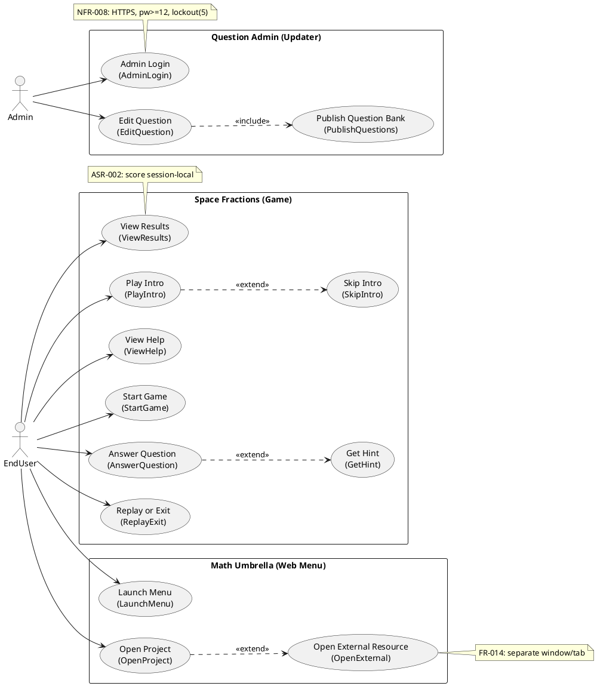

## LogicView
2. Class — Logic View: Class Diagram

```plantuml
@startuml Class
skinparam classAttributeIconSize 0

class GameApp {
  -appVersion: String
  -lastSyncAt: String
  +boot(): void
  +loadQuestionBank(): void
  +showMainMenu(): void
}

class MenuController {
  +playIntro(): void
  +skipIntro(): void
  +showHelp(): void
  +openExternal(url: String): void
}

class GameSession {
  -sessionId: String
  -startedAt: String
  -currentQuestionId: String
  -attemptsThisQuestion: int
  -pointsLockedForQuestion: boolean
  +start(): void
  +submitAnswer(choiceIndex: int): boolean
  +requestHint(): String
  +advance(nextQuestionId: String): void
  +finish(): void
}

class ScoreBoard <<immutable>> {
  -correctCount: int
  -totalQuestions: int
  -scorePoints: int
  -rank: String
  -message: String
  +awardPoints(points: int): ScoreBoard
  +lockPointsForCurrentQuestion(): ScoreBoard
  +computeRank(): String
  +composeMessage(): String
}

class QuestionBank <<cacheable>> {
  -version: String
  -etag: String
  -ttlSeconds: int
  +getQuestion(id: String): Question
  +getStartQuestionId(): String
  +reloadIfStale(now: String): boolean
}

class Question {
  +id: String
  +prompt: String
  +choices: String[ ]
  +correctIndex: int
  +critical: boolean
  +branchRules: BranchRule[ ]
  +inputMode: String
  +isCorrect(choiceIndex: int): boolean
  +nextQuestionId(answerCorrect: boolean): String
}

class BranchRule {
  +condition: String
  +nextQuestionId: String
}

class FractionInputValidator {
  +validate(numeratorText: String, denominatorText: String): ValidationResult
}

class ValidationResult {
  +valid: boolean
  +numerator: int
  +denominator: int
  +errorMessage: String
}

class PhysicsEngine {
  -currentVelocity: float
  +applyVelocityDelta(delta: float): void
  +setVelocity(v: float): void
}

class FractionConverter {
  +toDecimal(numerator: int, denominator: int): float
}

class FeedbackAnimator {
  +playCorrect(): void
  +playIncorrect(): void
  +showMessage(text: String): void
}

class SidekickAssistant {
  +getUsabilityHint(context: String): String
  +getAnswerHint(question: Question): String
}

class AdminUpdaterUI {
  +login(username: String, password: String): void
  +editQuestion(q: Question): void
  +publish(): void
}

class AdminAuthService {
  +authenticate(username: String, password: String): boolean
  +recordFailedAttempt(username: String): void
  +lockoutIfNeeded(username: String): void
}

class AuditLogger <<persisted>> {
  +logEvent(adminId: String, eventType: String, sourceIp: String): void
}

class QuestionBankRepository <<persisted>> {
  -filePath: String
  +readCurrent(): QuestionBank
  +validateSchema(bank: QuestionBank): boolean
  +atomicWrite(bank: QuestionBank): void
}

GameApp *-- MenuController
GameApp *-- GameSession
GameApp *-- QuestionBank

GameSession *-- ScoreBoard
GameSession o-- QuestionBank
GameSession --> FeedbackAnimator
GameSession --> SidekickAssistant
GameSession --> PhysicsEngine
GameSession --> FractionInputValidator
FractionInputValidator --> ValidationResult
PhysicsEngine <-- FractionConverter

QuestionBank *-- Question
Question *-- BranchRule

AdminUpdaterUI --> AdminAuthService
AdminUpdaterUI --> QuestionBankRepository
AdminUpdaterUI --> AuditLogger
QuestionBankRepository --> AuditLogger : logs publish

note right of QuestionBank
ASR-004: versioned JSON schema
ETag + TTL<=60s reload policy
end note

note right of AdminAuthService
NFR-008/ASR-005:
HTTPS-only, pw>=12, lockout after 5,
hash (bcrypt/Argon2), server sessions
end note

note bottom of GameSession
ASR-002: score/state session-local (single user per instance)
end note

note bottom of PhysicsEngine
NFR-006: real-time velocity update
end note
@enduml
```

3. Object — Logic View: Object Diagram

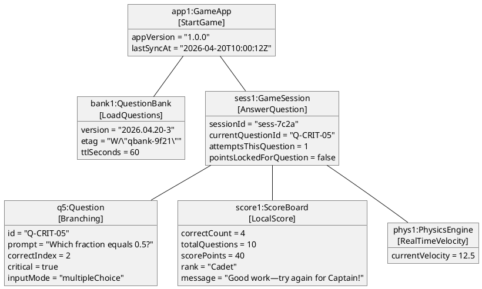

4. State — Logic View: State Diagram

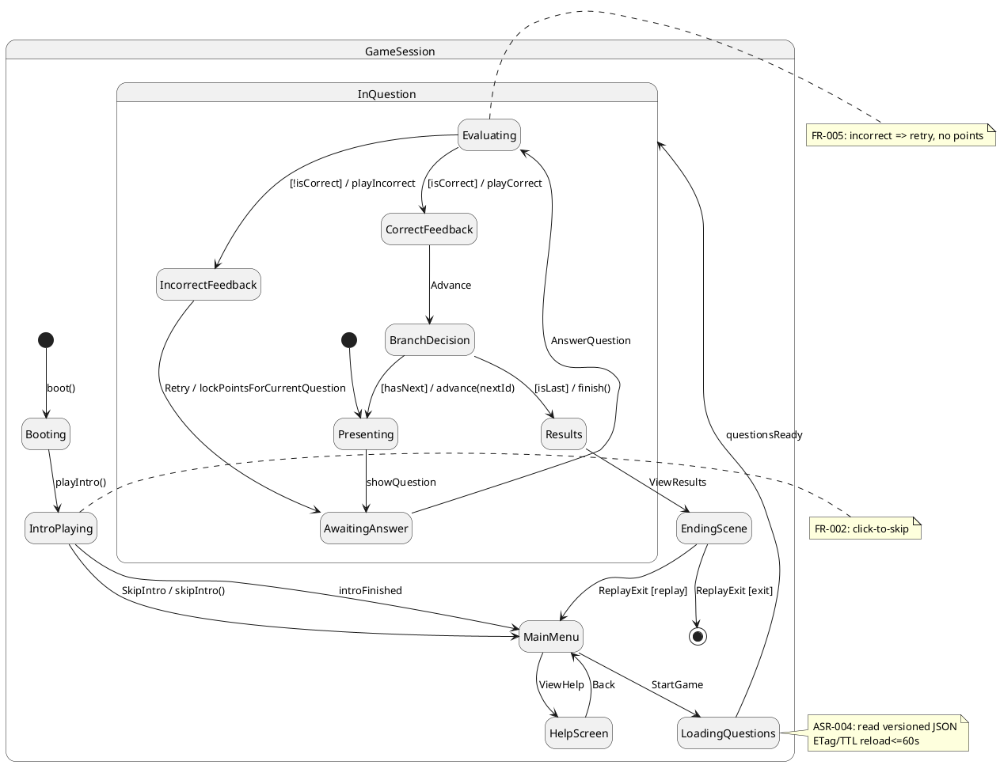

## ProcessView
5. Activity — Process View: Activity Diagram

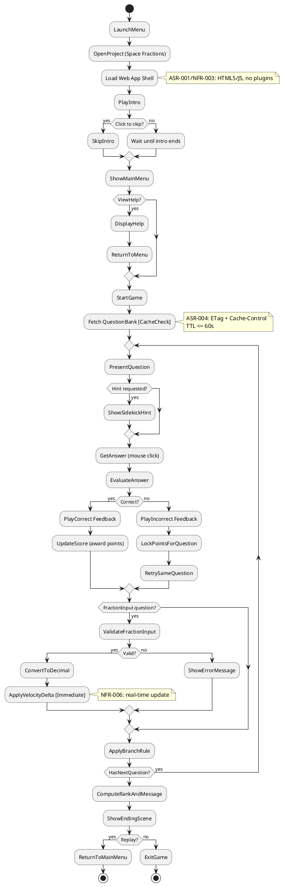

6. Sequence — Process View: Sequence Diagram

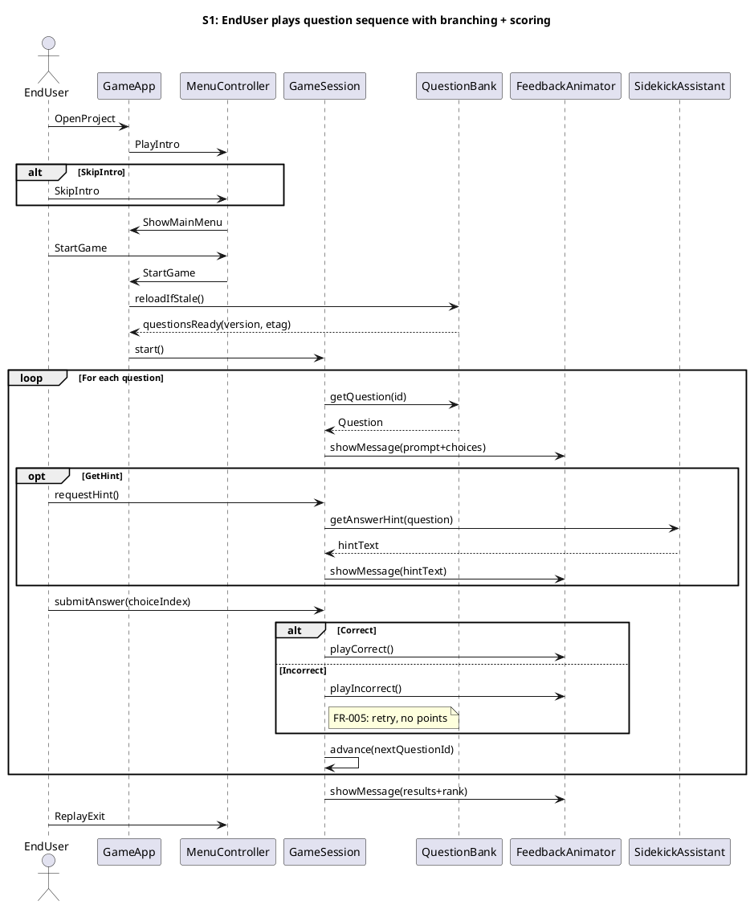

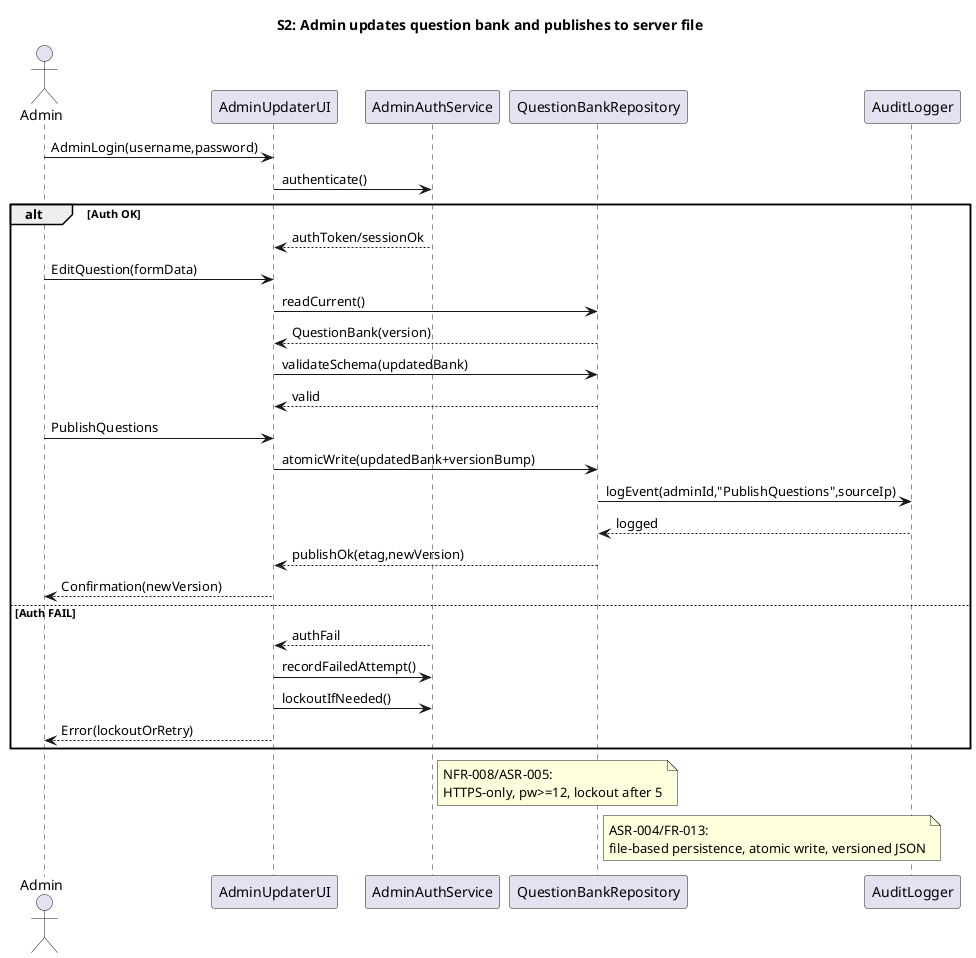

7. Collaboration — Process View: Collaboration Diagram

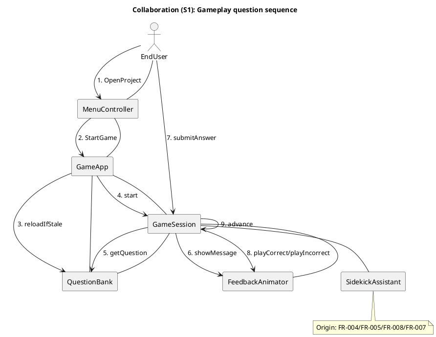

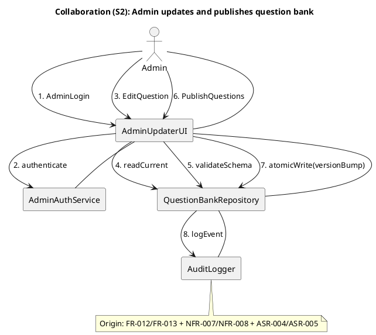

## DevelopmentView
8. Package — Development View: Package Diagram

```plantuml
@startuml Package
skinparam packageStyle rectangle

package "ui" as UI {
  note bottom
  Menus, intro, help, feedback, sidekick
  NFR-004 usability (mouse-driven)
  end note
}

package "domain" as Domain {
  note bottom
  Deterministic rules: validation, scoring, branching
  ASR-003 environment-invariant behavior
  end note
}

package "content" as Content {
  note bottom
  Question schema, versioning, TTL/ETag reload
  ASR-004 + ASR-006 bandwidth tactics
  end note
}

package "infrastructure" as Infra {
  note bottom
  HTTP, caching headers, storage adapters
  end note
}

package "admin" as AdminPkg {
  note bottom
  Admin updater UI + backend endpoints
  ASR-005 security + audit
  end note
}

package "security" as Security {
  note bottom
  Auth, sessions, password policy, lockout
  NFR-008
  end note
}

package "observability" as Obs {
  note bottom
  Audit logging + diagnostics hooks
  end note
}

UI ..> Domain : uses
UI ..> Content : uses
Domain ..> Content : reads
Content ..> Infra : uses
AdminPkg ..> Security : uses
AdminPkg ..> Content : updates
AdminPkg ..> Infra : uses
AdminPkg ..> Obs : logs
Security ..> Infra : uses
Obs ..> Infra : uses
@enduml
```

9. Component — Development View: Component Diagram

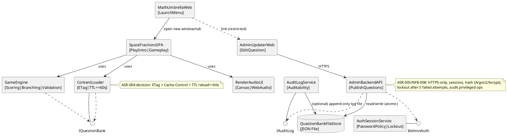

## PhysicalView
10. Deployment — Physical View: Deployment Diagram

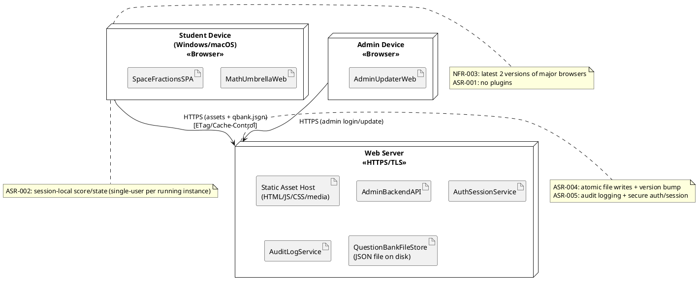

11. Container — Physical View: Container Diagram

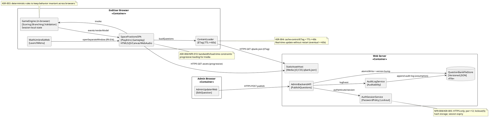